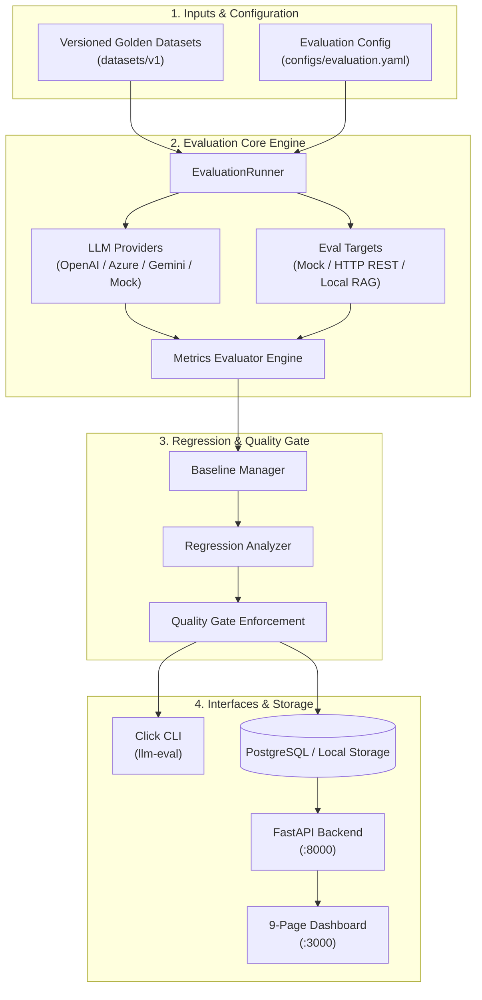

# LLM Eval CI/CD

<div align="center">

# Automated LLM + RAG Evaluation, Regression Detection & CI/CD Quality Gates

[](https://github.com/features/actions)
[](https://www.python.org/)
[](https://opensource.org/licenses/MIT)
[](https://docs.pytest.org/)
[](https://fastapi.tiangolo.com/)
[](https://www.docker.com/)
[](https://azure.microsoft.com/)

**Treat AI evaluation like continuous integration software testing.**

[Key Features](#-key-features) • [Architecture](#-architecture) • [Quick Start](#-quick-start) • [CLI Reference](#-cli-reference) • [Configuration](#-quality-gate-configuration) • [Engineering Dashboard](#-engineering-dashboard) • [CI/CD Workflow](#-cicd-pipeline-workflow) • [Deployment](#-production-deployment)

</div>

---

## 💡 Why LLM Eval CI/CD?

In modern LLM & RAG software development, small prompt changes, chunking adjustments, model upgrades (e.g., `gpt-4o-mini` $\rightarrow$ `gpt-4o`), or embedding parameter tweaks can introduce subtle regressions in accuracy, increase latency, or trigger hallucinations.

**LLM Eval CI/CD** introduces automated quality gates into your CI/CD pipeline. Before any prompt, model, or RAG configuration change hits production, this toolkit runs a versioned **golden dataset**, calculates deterministic and LLM-as-a-Judge metrics, compares the metrics against established baselines, and **fails the CI build** if quality degrades below safety thresholds.

```
                     ┌────────────────────────────────────────┐
                     │   Developer Modifies Model / Prompt    │
                     └───────────────────┬────────────────────┘
                                         │
                                         ▼
                     ┌────────────────────────────────────────┐
                     │    Run Golden Dataset Evaluation      │
                     └───────────────────┬────────────────────┘
                                         │
                                         ▼
                     ┌────────────────────────────────────────┐
                     │    Compute Metrics & Compare Baseline  │
                     └───────────────────┬────────────────────┘
                                         │
                         ┌───────────────┴───────────────┐
                         │                               │
                Quality Degraded?               Quality Passed?
                         │                               │
                         ▼                               ▼
            ❌ FAIL CI / Block Deploy       ✅ PASS CI / Deploy to Azure
```

---

## 🌟 Key Features

- 🎯 **Deterministic & LLM-as-a-Judge Evaluation**:
  - **Deterministic Metrics**: P50/P95 Latency, Token Usage (Input/Output), Estimated USD Cost.
  - **LLM-as-a-Judge Metrics**: Answer Relevance, Hallucination Rate, Semantic Correctness.
  - **RAG Retrieval Metrics**: Context Faithfulness, Retrieval Context Relevance, Retrieval Recall.
- ⚡ **Multi-Provider Support**: Built-in support for `OpenAI`, `Azure OpenAI`, `Google Gemini`, and an offline `Mock` provider for ultra-fast zero-cost CI pipeline runs.
- 🛡️ **Automated Quality Gates**: Hard exit-code guarantees (`exit code 1` on failure) ensuring broken or degrading prompts never slip past code reviews.
- 📊 **Baseline & Regression Analysis**: Quantitative regression detection algorithm comparing candidate model metrics against set baseline runs with careful non-causal reporting.
- 🖥️ **9-Page Interactive Engineering Dashboard**: Fast, rich web console (FastAPI + HTML5/CSS3) providing Pareto cost-quality frontiers, regression deltas, side-by-side model matrix comparisons, and quality gate management.
- 🐳 **Lean Docker Footprint**: Multi-stage build under **350MB** (strictly enforced $\le 500\text{MB}$) without heavy PyTorch/TensorFlow weight overhead.
- ☁️ **Cloud Native Infrastructure**: Production-ready Infrastructure-as-Code (Bicep) for Azure Container Apps, PostgreSQL Flexible Server, Azure Blob Storage, and App Insights.

---

## 🏗 Architecture



### Module Layout

```
llm-eval-cicd/
├── .github/workflows/       # GitHub Actions CI/CD pipeline (Unit -> Eval -> Gate -> Docker -> Azure)
├── backend/                 # FastAPI REST API, SQLAlchemy ORM models, and service layer
│   └── app/
│       ├── api/             # API routers (evaluations, experiments, comparisons, quality gate)
│       ├── core/            # Config & Database engine setup
│       └── services/        # Core business & gate validation services
├── configs/                 # YAML Configuration specifying thresholds & provider settings
├── datasets/                # Schema-validated Golden Datasets (v1 JSON/YAML)
├── demo_rag/                # Fast lightweight in-memory BM25/Keyword RAG test target
├── evaluator/               # Core Evaluation Package
│   ├── cli/                 # Click CLI interface (run, gate, compare, report, dataset)
│   ├── comparison/          # Model-to-Model & Model-x-RAG matrix comparator
│   ├── datasets/            # Dataset loader, Pydantic schemas, & validator
│   ├── metrics/             # LLM (relevance, hallucination) & RAG (faithfulness, recall) metrics
│   ├── providers/           # Provider implementations (OpenAI, Azure, Gemini, Mock)
│   ├── regression/          # Baseline manager, regression analyzer, & quality gate engine
│   ├── runners/             # EvaluationRunner execution engine
│   ├── storage/             # Blob & Local storage backends
│   ├── targets/             # Evaluation target adapters (Mock, HTTP, Local RAG)
│   └── tests/               # 48+ comprehensive unit & integration tests (95%+ coverage)
├── frontend/                # 9-page Engineering Dashboard UI (Vanilla HTML5/CSS3/JS)
├── infrastructure/          # Azure Bicep IaC templates & parameter manifests
├── scripts/                 # Utility scripts (Docker image size verification, dataset generators)
├── Dockerfile               # Multi-stage container build specification
├── docker-compose.yml       # Full stack local orchestration (PostgreSQL + API + App)
└── pyproject.toml           # Project dependencies & tool configurations
```

---

## 🚀 Quick Start

### 1. Prerequisites & Installation

- Python `3.11` or higher
- Git

```bash
# Clone the repository
git clone https://github.com/munikumarnetlapalli/LLM-Eval-CI-CD.git
cd llm-eval-cicd

# Install editable package with development dependencies
pip install -e ".[dev]"
```

### 2. Environment Setup

Copy `.env.example` to `.env` and fill in your API keys (optional for mock mode):

```bash
cp .env.example .env
```

### 3. Validate Golden Dataset

Ensure your test dataset adheres to the schema:

```bash
llm-eval dataset validate datasets/v1
```

### 4. Execute Evaluation Run

Run an evaluation against your dataset using the offline `mock` provider (no API key required):

```bash
llm-eval run --config configs/evaluation.yaml
```

### 5. Evaluate Quality Gate

Pass the run output ID to check whether the evaluation passes your release threshold:

```bash
llm-eval gate --run <RUN_ID> --config configs/evaluation.yaml
```

### 6. Promote Baseline & Compare Runs

Promote a high-performing run as the official baseline for future regression checks:

```bash
# Promote run to baseline
llm-eval run --config configs/evaluation.yaml --set-baseline

# Compare a candidate run against the baseline
llm-eval compare --baseline <BASELINE_RUN_ID> --candidate <CANDIDATE_RUN_ID>
```

---

## 💻 CLI Reference

The `llm-eval` CLI provides comprehensive control over evaluation runs, dataset validation, regression comparisons, and CI/CD quality gate enforcement.

| Command | Arguments / Flags | Description |
| :--- | :--- | :--- |
| `llm-eval run` | `--config <path>`<br/>`--environment <env>`<br/>`--output <path>`<br/>`--set-baseline` | Executes evaluation run against the golden dataset. Optionally sets the run as the baseline. |
| `llm-eval gate` | `--run <run-id>`<br/>`--config <path>` | Evaluates quality gate thresholds. **Exits with status code 1 on failure** to fail CI/CD builds. |
| `llm-eval compare` | `--baseline <id>`<br/>`--candidate <id>` | Performs detailed regression analysis between baseline and candidate runs. |
| `llm-eval report` | `--run <id>` | Prints detailed run breakdown and metric summary to terminal. |
| `llm-eval dataset validate` | `<dataset-path>` | Validates dataset format, ID uniqueness, and schema compliance. |

---

## ⚙️ Quality Gate Configuration

Quality gates are controlled via `configs/evaluation.yaml`. You can set strict minimums for quality and maximums for latency, hallucination rate, and cost per query:

```yaml
version: "1.0"
environment: "ci"

model:
  provider: "openai"          # Options: openai, azure_openai, gemini, mock
  name: "gpt-4o"
  temperature: 0.0

quality_gate:
  faithfulness:
    minimum: 0.90             # Faithfulness < 0.90 -> Gate fails -> CI blocks deployment
  answer_relevance:
    minimum: 0.80             # Answer relevance threshold
  hallucination_rate:
    maximum: 0.05             # > 5% hallucination -> Gate fails
  context_relevance:
    minimum: 0.80             # Minimum context relevance score
  p95_latency_ms:
    maximum_ms: 1000          # 95th percentile latency threshold
  cost_per_query:
    maximum_usd: 0.02         # Max average query cost threshold
```

---

## 🔬 Metrics Specification

LLM Eval CI/CD partitions metrics into three distinct evaluation dimensions:

### 1. Deterministic Metrics
- **P50 / P95 Latency**: Measured in milliseconds per completion query.
- **Token Count**: Input prompt tokens, output completion tokens, and total token usage tracked via `tiktoken`.
- **Cost per Query**: Estimated USD spend per query based on exact provider token pricing.

### 2. LLM-as-a-Judge Metrics
- **Answer Relevance ($0.0 - 1.0$)**: Evaluates how directly and completely the model response answers the user query.
- **Hallucination Rate ($0.0 - 1.0$)**: Fraction of generated facts that lack grounding in provided reference facts (lower is better).
- **Semantic Correctness ($0.0 - 1.0$)**: High-dimensional semantic similarity against expected ground-truth answers.

### 3. RAG Retrieval Metrics
- **Faithfulness ($0.0 - 1.0$)**: Checks if all claims made in the answer are strictly supported by retrieved context.
- **Context Relevance ($0.0 - 1.0$)**: Measures noise ratio in retrieved document chunks.
- **Retrieval Recall ($0.0 - 1.0$)**: Ratio of gold-standard target information captured in top-k retrieval results.

---

## 📊 Engineering Dashboard

The project includes a 9-page engineering dashboard built with FastAPI and modern vanilla HTML5/CSS3.

To launch the dashboard locally:

```bash
# Start backend API server
uvicorn backend.app.main:app --reload --port 8000
```

Open `frontend/index.html` directly in your browser, or serve it via Python:

```bash
python -m http.server 3000 --directory frontend
```

### Dashboard Pages

1. **Overview Dashboard**: High-level telemetry, total run count, pass/fail ratios, and metric trend charts.
2. **Evaluation Runs**: Paginated table of historical evaluation runs with environment filtering.
3. **Run Details**: Per-case metric breakdown, failure analysis, and quality gate status banners.
4. **Model Comparison**: Side-by-side performance matrices comparing OpenAI, Azure, and Gemini.
5. **RAG Comparison**: Model $\times$ RAG grid analyzing chunking strategy and retrieval top-k impact.
6. **Regression Analyzer**: Delta comparison view highlighting regression areas between candidate and baseline.
7. **Dataset Management**: Version history, dataset schema validation status, and category distribution.
8. **Cost vs Quality Frontier**: Interactive Pareto frontier scatter plot balancing cost (\$) vs accuracy.
9. **Quality Gate Console**: Live YAML configuration editor and interactive gate check trigger.

---

## 🔄 CI/CD Pipeline Workflow

The project contains a pre-configured GitHub Actions workflow (`.github/workflows/eval-pipeline.yml`) enforcing quality gates automatically on pull requests and main branch commits:

```
Push / PR to Main
       │
       ▼
┌──────────────────┐
│ 1. Unit Tests    │ ──► Pytest (48+ tests), Dataset validation, Code coverage (95%+)
└────────┬─────────┘
         │
         ▼
┌──────────────────┐
│ 2. Golden Eval   │ ──► llm-eval run --config configs/evaluation.yaml
└────────┬─────────┘
         │
         ▼
┌──────────────────┐
│ 3. Quality Gate  │ ──► llm-eval gate --run <RUN_ID> --config configs/evaluation.yaml
└────────┬─────────┘     (CRITICAL: Non-zero exit code on failure BLOCKS deployment)
         │
         ▼
┌──────────────────┐
│ 4. Docker Build  │ ──► Multi-stage build + Size check script (≤ 500MB constraint)
└────────┬─────────┘
         │
         ▼
┌──────────────────┐
│ 5. Azure Deploy  │ ──► Push to ACR -> Deploy to Azure Container Apps (Main branch only)
└──────────────────┘
```

---

## 🐳 Docker Containerization

The repository features a multi-stage Docker build optimized for production security and minimal size.

```bash
# Build Docker image
docker build -t llm-eval-cicd .

# Run container locally
docker run -p 8000:8000 \
  -e LLM_PROVIDER=mock \
  -e STORAGE_BACKEND=local \
  llm-eval-cicd

# Launch full stack with PostgreSQL using Docker Compose
docker-compose up -d
```

> 💡 **Image Size Guarantee**: The production container image is strictly constrained to **< 350MB** (verified via `scripts/check_image_size.py` in CI) by removing unnecessary build dependencies and omitting heavy PyTorch/TensorFlow binaries.

---

## ☁️ Production Deployment

Infrastructure is defined using **Azure Bicep** in `infrastructure/main.bicep`. To deploy the full stack to Azure:

```bash
# Provision Azure Infrastructure (Container Apps, Postgres Flexible Server, Blob Storage, App Insights)
az deployment group create \
  --resource-group <your-resource-group> \
  --template-file infrastructure/main.bicep \
  --parameters @infrastructure/main.parameters.json \
  --parameters postgresAdminPassword=$POSTGRES_PWD \
               openaiApiKey=$OPENAI_API_KEY
```

---

## 🧪 Testing

Run the comprehensive unit test suite:

```bash
# Execute pytest suite
pytest evaluator/tests/ -v

# Run coverage report
pytest evaluator/tests/ --cov=evaluator --cov-report=term-missing
```

```
============================= 48 passed in 1.71s ==============================
```

---

## 📜 License

Distributed under the **MIT License**. See [`LICENSE`](LICENSE) for more information.

